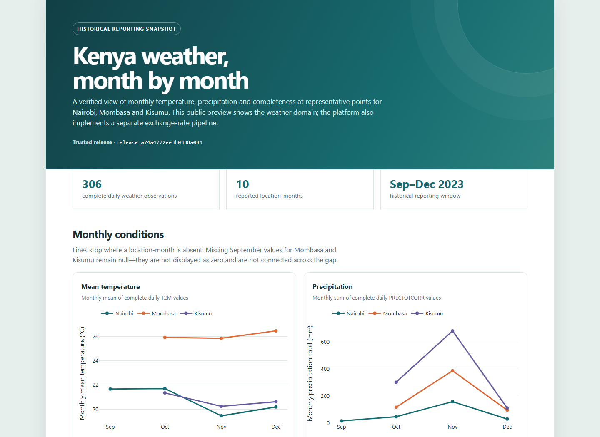
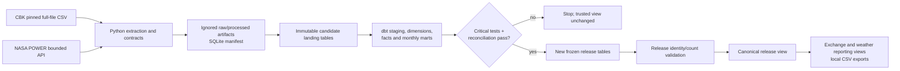
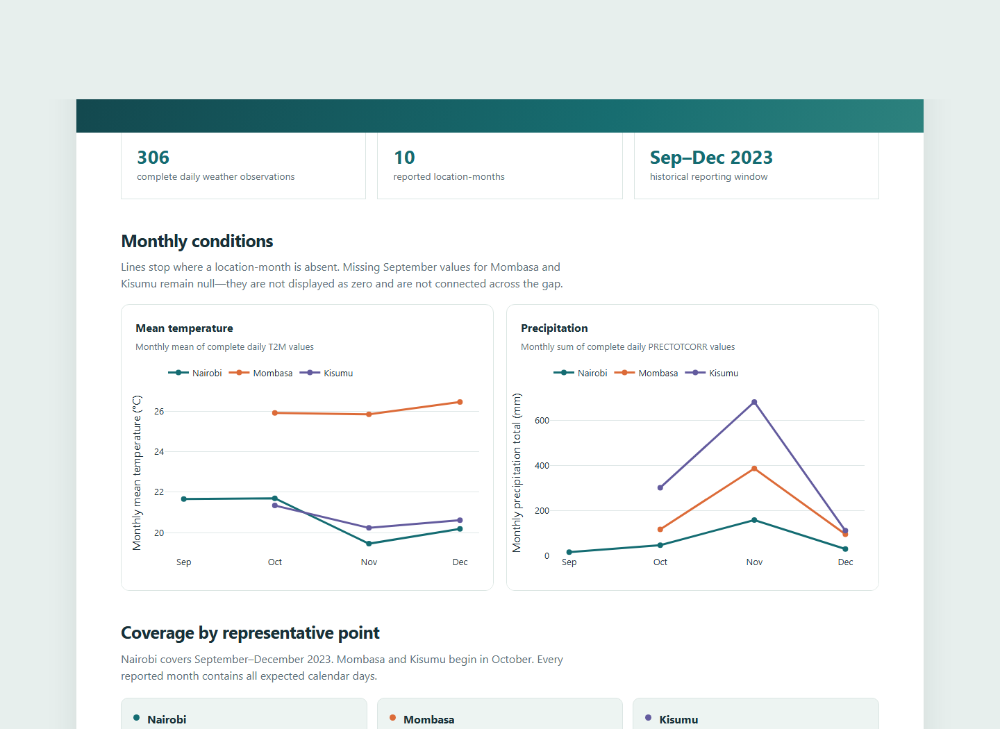

# Kenya Economic Data Platform

Kenya Economic Data Platform is a personal data engineering project that
ingests historical exchange-rate and weather data, validates and models it in
BigQuery with dbt, and publishes reproducible reporting outputs. It implements
reliable ingestion, raw preservation, warehouse modelling, validation,
orchestration, scoped backfills, recovery, and local reporting.



The image is a historical reporting snapshot from the verified release. The
public preview intentionally shows only NASA POWER weather results; the platform
also implements a separate exchange-rate pipeline. A hosted dashboard link will
be added only after GitHub Pages deployment is enabled and verified.

The final verified release is `release_a74a4772ee3b0338a041`: 177 daily
exchange observations become 9 monthly rows, while 306 daily weather
observations become 10 monthly rows. All baseline measurements survived the
demonstrated Nairobi September backfill unchanged. A live, isolated missing-day
fault made dbt fail and publication stop; the trusted report stayed unchanged,
and a clean recovery subsequently passed.

The project runs from a laptop and has no cloud scheduler, uptime commitment,
streaming ingestion, incremental dbt models, or billing-enabled resources.

## Architecture



Candidate relations can be rebuilt; frozen release relations are never updated
by application code. Publication is one `CREATE OR REPLACE VIEW` statement.
This is behavioural immutability, not a claim that BigQuery permissions prevent
an authorized person from manually altering or deleting a table.

## Verified scope

| Domain | Grain | Coverage | Observations | Monthly rows |
|---|---|---|---:|---:|
| CBK exchange | publication date × USD/GBP/EUR | 2023-10-02 to 2023-12-29 | 177 | 9 |
| Nairobi weather | UTC date × representative grid point | 2023-09-01 to 2023-12-31 | 122 | 4 |
| Mombasa weather | UTC date × representative grid point | 2023-10-01 to 2023-12-31 | 92 | 3 |
| Kisumu weather | UTC date × representative grid point | 2023-10-01 to 2023-12-31 | 92 | 3 |

Exchange weekends and holidays are not fabricated. Weather values are NASA
POWER grid-cell estimates, not station observations or city-wide measurements.
The complete acceptance trail is in [Phase 4 evidence](docs/evidence/phase_4.md).

## Prerequisites and pinned toolchain

- Windows PowerShell 7 or Windows PowerShell 5.1;
- Git;
- `uv` (operator rehearsal used 0.12.9);
- Python 3.12, selected by `.python-version`;
- Google Cloud CLI for Application Default Credentials (ADC);
- a Google Cloud project eligible for BigQuery Sandbox, with BigQuery already
  available and billing **not attached**.

`uv.lock` freezes the Python environment. Direct project pins include
`dbt-core==1.12.5`, `dbt-bigquery==1.12.1`, and `pytest==8.4.2`.

## Windows setup

```powershell
git clone REPOSITORY_URL kenya-economic-data-platform
Set-Location kenya-economic-data-platform

uv python install 3.12
uv sync --frozen --dev
uv run python --version
uv run dbt --version
```

Copy only the non-secret templates when local overrides are needed:

```powershell
Copy-Item config\settings.example.toml config\settings.toml
Copy-Item config\profiles.example.yml config\profiles.yml
```

Both destination files are ignored. Never put ADC files, service-account keys,
raw downloads, SQLite manifests, generated reports, or dbt targets in Git.

### Obtain and verify the CBK source file

CBK extraction deliberately filters a pinned full-file download; it is not a
rolling current-rate feed. Download the official historical CSV shown in
[`docs/source_inventory.md`](docs/source_inventory.md), save it outside Git (the
default ignored path is `data/raw/phase_0/cbk_historical_retry.csv`), and verify
it before extraction:

```powershell
$CbkPath = "data\raw\phase_0\cbk_historical_retry.csv"
New-Item -ItemType Directory -Force (Split-Path $CbkPath) | Out-Null
Invoke-WebRequest `
  -Uri "https://www.centralbank.go.ke/uploads/fx_rates/historical_data.csv" `
  -OutFile $CbkPath
(Get-FileHash -Algorithm SHA256 $CbkPath).Hash.ToLowerInvariant()
```

For the verified snapshot, the result must be
`eaea9637cf763ea61ebb81661ed6471f50f79051cc983dff9cac072d92d8c677`.
If CBK serves different bytes, do not relabel them as the verified snapshot:
review provenance and parsing, update an ignored local configuration only after
validation, and create a new batch. CBK redistribution terms remain unresolved,
so the raw file is intentionally absent from this repository.

## Authentication and explicit cloud configuration

ADC stays in the operating-system credential store, outside the repository:

```powershell
$ProjectId = "YOUR_GCP_PROJECT"
$Location = "US"

gcloud auth application-default login `
  --scopes=https://www.googleapis.com/auth/cloud-platform
gcloud auth application-default set-quota-project $ProjectId
$env:GOOGLE_CLOUD_PROJECT = $ProjectId
$env:KEP_GCP_PROJECT = $ProjectId
$env:KEP_BQ_LOCATION = $Location
```

Confirm the selected identity/project and check billing read-only before any
warehouse command:

```powershell
gcloud auth list
gcloud config get-value project
gcloud billing projects describe $ProjectId
```

Set a gcloud project explicitly if desired with `gcloud config set project
$ProjectId`; the application still requires `--project` on cloud commands.
This project was accepted only with billing disabled. Do not attach a billing
account, enable paid services, or proceed if the billing check is ambiguous.

BigQuery Sandbox resources expire. This implementation uses owned `kep_`
datasets in `US`, 60-day default expiration, two dbt threads, and a 1 GiB
maximum-bytes-billed guard on application/dbt queries. Sandbox quotas and object
expiration make it unsuitable as durable production storage.

## Local validation

These commands require no warehouse access:

```powershell
uv run python -m compileall -q src tests scripts
uv run pytest -q -p no:cacheprovider

Copy-Item config\profiles.example.yml config\profiles.yml -Force
$env:KEP_GCP_PROJECT = "offline-no-cloud-project"
$env:KEP_BQ_DATASET = "kep_offline_candidate"
$env:KEP_BQ_LOCATION = "US"
$env:KEP_CBK_TABLE = "landing_cbk_offline"
$env:KEP_NASA_TABLE = "landing_nasa_offline"
uv run dbt parse --profiles-dir config --no-partial-parse
uv run dbt docs generate --profiles-dir config --empty-catalog --static `
  --no-compile --no-partial-parse
```

The last command creates offline lineage/documentation artifacts under the
ignored `target/` directory with an empty warehouse catalog. Open
`target/static_index.html` locally. A connected catalog requires the online
`dbt docs generate` command in the runbook.

## Operate the pipeline

Inspect the CLI and configuration before running:

```powershell
uv run python -m kenya_economic_data --help
uv run python -m kenya_economic_data operate --help
uv run python -c "from pathlib import Path; from kenya_economic_data.config import load_settings; print(load_settings(Path('config/settings.example.toml')))"
```

An initial bounded historical run uses a new owned candidate dataset:

```powershell
uv run python -m kenya_economic_data operate `
  --project $ProjectId --location $Location `
  --candidate-dataset kep_candidate_v1 `
  --trusted-dataset kep_trusted_v1 `
  --start-date 2023-10-01 --end-date 2023-12-31 `
  --locations Nairobi Mombasa Kisumu
```

The command coordinates extraction/reuse, immutable loads, dbt build and tests,
source-to-fact reconciliation, frozen release construction, canonical switch,
and local exports. Repeating an unchanged command reuses matching artifacts;
operational timestamps can change while report content does not.

The final demonstrated asymmetric backfill selected explicit verified batches:

```powershell
uv run python -m kenya_economic_data operate `
  --project $ProjectId --location $Location `
  --candidate-dataset kep_candidate_recovery_202309_nairobi_v1 `
  --trusted-dataset kep_trusted_v1 `
  --start-date 2023-09-01 --end-date 2023-12-31 `
  --locations Nairobi Mombasa Kisumu `
  --cbk-batch-id batch_1fbe96c779d3e2aa706b `
  --nasa-batch-id composition_a42482249b647d68ddaa
```

Those identifiers describe the verified local manifest and are evidence, not
portable defaults for a fresh clone. A new operator obtains batch IDs from
successful extraction/composition output.

## Reporting and operations

```powershell
uv run python -m kenya_economic_data health `
  --project $ProjectId --location $Location `
  --trusted-dataset kep_trusted_v1

uv run python -m kenya_economic_data retry-export `
  --project $ProjectId --location $Location `
  --trusted-dataset kep_trusted_v1 `
  --release-id release_a74a4772ee3b0338a041
```

Consumers query `kep_trusted_v1.exchange_monthly` and
`kep_trusted_v1.weather_monthly`; both resolve through
`kep_trusted_v1.canonical_release`. `retry-export` is only for the current
release and does not rebuild the warehouse. Failure, rerun, scoped backfill,
rollback, export retry, and expiration procedures are in the
[`operator runbook`](docs/operator_runbook.md).

### Local results dashboard

The trusted CSV exports can be rendered without extraction, warehouse access,
rebuilding, or publication:

```powershell
$ReleaseId = "release_a74a4772ee3b0338a041"
uv run python -m kenya_economic_data render-dashboard `
  --report-dir "data\reports\$ReleaseId"
Start-Process "data\reports\$ReleaseId\results_dashboard.html"
```

The renderer requires matching exchange and weather release identities. It
derives counts and coverage from the trusted exports and their metadata, keeps
missing months missing, and bundles Plotly in the HTML for offline viewing. The
real-data HTML and its CSV inputs stay under ignored `data/reports/` because CBK
redistribution terms remain unresolved.

### Public weather dashboard preview

The dedicated [public dashboard](site/index.html) is a self-contained,
weather-only view of `release_a74a4772ee3b0338a041`. It shows monthly mean
temperature, monthly precipitation totals, location/month coverage and an exact
value table for September–December 2023. Nairobi starts in September; Mombasa
and Kisumu start in October, with their missing September values preserved as
null rather than zero.



Open the checked-in preview directly:

```powershell
Start-Process "site\index.html"
```

Plotly is bundled locally, so viewing needs no CDN, API or credentials. NASA
POWER values are gridded MERRA-2/GEOS-IT estimates at representative points,
not station observations or city-wide measurements. Attribution, the applicable
NASA Earthdata policy reference, regeneration instructions and the remaining
manual GitHub Pages steps are in the
[public dashboard guide](docs/public_dashboard.md). No hosted URL is claimed
until that deployment is completed and checked.

## Documentation

- [Source inventory](docs/source_inventory.md): provenance, terms, units,
  cadence, coverage, and source limitations.
- [Data dictionary](docs/data_dictionary.md): ingestion, warehouse, and report
  fields.
- [Warehouse models](docs/warehouse_models.md): grains, formulas, dbt lineage,
  and dbt docs commands.
- [Operator runbook](docs/operator_runbook.md): operating and recovery paths.
- [Phase 1](docs/evidence/phase_1.md), [Phase 2](docs/evidence/phase_2.md),
  [Phase 3](docs/evidence/phase_3.md), and
  [Phase 4](docs/evidence/phase_4.md) evidence.
- [Project overview](docs/project_overview.md) and
  [sprint closeout](docs/sprint_closeout.md).
- [Public dashboard guide](docs/public_dashboard.md): source policy, local use,
  regeneration and deferred GitHub Pages publication.

## Limitations and deferred work

- CBK publishes a whole historical file; the platform filters a pinned snapshot
  and does not promise a current rolling feed.
- CBK raw-data redistribution is deferred until reuse terms are clarified.
- NASA POWER values are gridded estimates with floating aggregation noise; the
  acceptance tolerance is documented in Phase 4 evidence.
- Sandbox datasets expire, and the local manifest/source artifacts are required
  for straightforward recovery.
- Operation depends on one connected laptop and explicit human execution.
- GitHub Actions validates code only and has not yet run remotely; it is not a
  warehouse schedule.
- Food prices, streaming, incremental dbt, managed orchestration, production
  IAM hardening, monitoring/SLOs, and AI/ML are out of scope.

