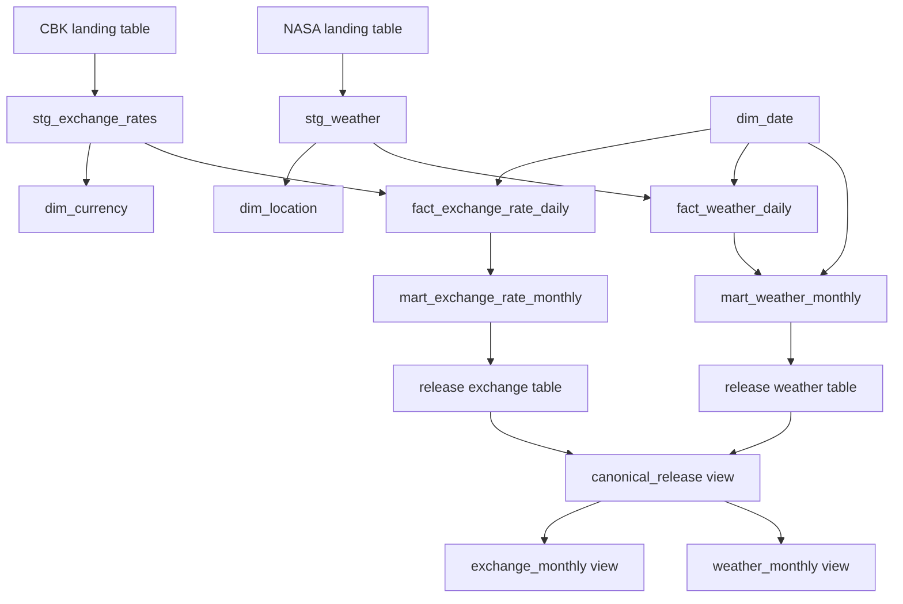

# Warehouse models and lineage

The dbt project builds candidates in a caller-selected dataset. Staging models
are views; dimensions, daily facts, and monthly marts are tables. The final
accepted candidate is frozen into a separate release dataset before the trusted
view can move.

## Implemented lineage



`dim_date` is generated from the effective requested scope. For asymmetric
weather backfills, expected per-location ranges are passed to critical tests;
the September Nairobi addition therefore does not invent September rows for
Mombasa or Kisumu.

## Grains and formulas

| Model | Materialization | Grain | Definition |
|---|---|---|---|
| `stg_exchange_rates` | view | publication date × currency | Typed CBK rows with batch/snapshot provenance. |
| `stg_weather` | view | UTC date × representative point | Typed NASA POWER measurements and provenance. |
| `dim_date` | table | calendar date | Dates in the effective bounded scope. |
| `dim_currency` | table | currency | USD, GBP, EUR and KES-per-one-unit semantics. |
| `dim_location` | table | representative point | Nairobi, Mombasa, Kisumu coordinates and grid limitation. |
| `fact_exchange_rate_daily` | table | publication date × currency | Mean/buy/sell; no weekend or holiday fabrication. |
| `fact_weather_daily` | table | UTC date × location | Daily T2M in C and PRECTOTCORR in mm/day. |
| `mart_exchange_rate_monthly` | table | currency × month | Mean of available daily mean rates plus first/last dates and count. |
| `mart_weather_monthly` | table | location × month | Mean T2M, sum precipitation, and completeness counts. |

Exchange monthly mean:

`SUM(daily mean_rate) / publication_observation_count`

Weather monthly mean temperature:

`SUM(daily T2M) / observed_day_count`

Weather monthly precipitation:

`SUM(daily PRECTOTCORR)` in millimetres, returned as null if any daily input is
null. Critical tests require zero missing precipitation days and
`observed_day_count = expected_day_count` for every expected location/month.

Exchange and weather remain separate facts. The implementation creates no
city-level exchange rate, cost-of-living measure, or composite index.

## Quality gates

Schema tests cover not-null values, accepted codes, business-key uniqueness,
and fact-to-dimension relationships. Four singular critical tests additionally
check CBK semantics/completeness, weather semantics/per-location completeness,
landing-to-fact reconciliation, and expected monthly keys/counts. The final
recovery built 9 models and passed 39 tests.

## Generate and view dbt documentation

Set explicit source-table selections; never guess them from historical IDs:

```powershell
Copy-Item config\profiles.example.yml config\profiles.yml -Force
$env:KEP_GCP_PROJECT = "YOUR_GCP_PROJECT"
$env:KEP_BQ_LOCATION = "US"
$env:KEP_BQ_DATASET = "YOUR_CANDIDATE_DATASET"
$env:KEP_CBK_TABLE = "YOUR_CBK_LANDING_TABLE"
$env:KEP_NASA_TABLE = "YOUR_NASA_LANDING_TABLE"

uv run dbt parse --profiles-dir config --no-partial-parse
uv run dbt docs generate --profiles-dir config --exclude tag:sandbox_probe `
  --no-partial-parse --static
uv run dbt docs serve --profiles-dir config
```

`dbt docs generate` without `--empty-catalog` uses warehouse metadata and ADC.
For an offline structural site, use:

```powershell
uv run dbt docs generate --profiles-dir config --empty-catalog --static `
  --no-compile --no-partial-parse
```

The offline site describes parsed lineage but intentionally has no live catalog
statistics. Generated `target/` content is ignored by Git.

## Immutability boundary

The loader refuses an existing candidate table unless row count, schema,
artifact fingerprint, batch identity, and ownership metadata match. Release
tables are created once and validated before the canonical view switch; the
application has no update/delete path for them. BigQuery IAM was not hardened to
make every possible manual mutation impossible, so “immutable” in this project
means enforced by application behaviour and verified identity—not absolute
physical protection from a sufficiently privileged operator.

